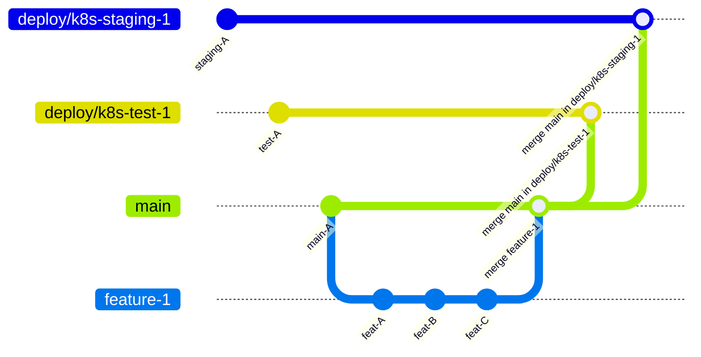

# Deployment

VLIC-managed deployments are automatically updated when commits are pushed to the `deploy/*` branches. The `deploy.yaml` action running on these branches can decrypt secrets, connect to the relevant k8s cluster, and use helm.

To update a deployment, the `main` branch should be merged in the appropriate `deploy/` branch through a PR. Upon merging, the `deploy.yaml` action will update the changes.

The diagram below illustrates the creation and merging of a feature branch into `main`, followed by the deployment to `k8s-test-1` and later to `k8s-staging-1`.

### Branches protection

Branches `deploy/**/*` are protected by a ruleset, which enforces that changes be made through a PR with passing tests and approval.

### Environments

Each `deploy/*` branch has a matching environment, containing the configuration and secrets needed for the deployment. This includes SSH and kubeconfig credentials.

### Secrets decryption

Secrets are decrypted with AWS KMS. The `deploy.yaml` action authenticates through OIDC and assumes a role that can be accessed through the `deploy/*` environment. When run from other contexts, the `deploy.yaml` action is not authorized to decrypt secrets.

The full setup is documented here: https://github.com/QCDIS/infrastructure/blob/main/secrets/README.md#aws-kms-setup-for-ci