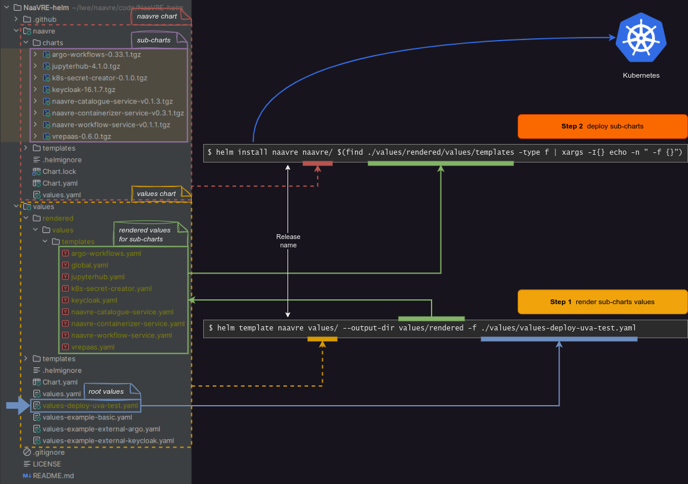

# NaaVRE-helm

## Overview

NaaVRE consists of several components which have their own Helm charts (Keycloak, Argo, Jupyter Hub, VREPaaS, all NaaVRE-*-services and more).
They are all sub-charts of the `naavre` chart.

However, Helm requires to set values for all sub-charts manually.
This is time-consuming, error-prone, and results in a lot of duplicate configurations (e.g. repeated domain names or internal tokens).

To address this issue, we first render sub-chart values through the `values` chart.
This allows us to render sub-chart values from a single file without duplicate configurations.

The deployment is done in two steps:

- **Step 1:** render values for the sub-charts, using the `values` chart
- **Step 2:** Deploy the sub-charts, using the `naavre` chart and the previously-rendered values.



## Deployment

Create a new root values file and fill in your values. This can be done by copying one of the examples:

```shell
cp ./values/values-example-basic.yaml ./values/values-deploy-my-deployment.yaml
vim ./values/values-deploy-my-deployment.yaml
```

> [!CAUTION]
> Values files (`./values/values-deploy-*.yaml`) contain secrets. They are ignored by default by Git. Never commit them!

Download the sub-charts:

```shell
helm dependency build naavre
```

Render the `values` chart (step 1) and deploy the `naavre` chart (step 2):

```shell
root_values="./values/values-deploy-my-deployment.yaml"
context="minikube"
namespace="naavre"
release_name="naavre"
helm template "$release_name" values/ --output-dir values/rendered -f "$root_values" && \
helm --kube-context "$context" -n "$namespace" upgrade --create-namespace --install "$release_name" naavre/ $(find values/rendered/values/templates -type f | xargs -I{} echo -n " -f {}")
```

> [!NOTE]
> Never edit files in `values/rendered`. Instead, change `./values/values-deploy-my-deployment.yaml` or `values/templates/*.yaml` and re-render the `values` chart.

## Uninstall

```shell
helm -n naavre uninstall naavre
```

## Secrets and deployment values

Secrets and deployment values are managed with [SOPS](https://github.com/getsops/sops) and [helm-secrets](https://github.com/jkroepke/helm-secrets).

### Initial setup

-  Configure SOPS with VLIC's keys ([documentation](https://github.com/QCDIS/infrastructure/blob/main/secrets/README.md); private)).
   Don't forget to set the `AWS_PROFILE` environment variable for the project.
-  Install `helm-secrets`
   ```shell
   helm plugin install https://github.com/jkroepke/helm-secrets
   ```

### Create a new encrypted values file

- Create a new _unencrypted_ values file (same as in the [Deployment](#deployment) section):
  ```shell
  cp ./values/values-example-basic.yaml ./values/values-deploy-my-deployment.yaml
  ```

- Encrypt it:
  ```shell
  helm secrets encrypt values/values-deploy-my-deployment.yaml > values/values-deploy-my-deployment.sops.yaml
  ```

- Remove the _unencrypted_ file:
  ```shell
  rm values/values-deploy-my-deployment.yaml
  ```

The encrypted file (`values-*.sops.yaml`) can safely commited to Git.

### Edit an encrypted values file

```shell
helm secrets edit values/values-deploy-my-deployment.sops.yaml
```

Or in Pycharm using the [Simple Sops Edit plugin](https://plugins.jetbrains.com/plugin/21317-simple-sops-edit) (read our [documentation](https://github.com/QCDIS/infrastructure/blob/main/secrets/README.md#pycharm-integration)).

### Deploy with encrypted values

```shell
root_values="./values/values-deploy-my-deployment.sops.yaml"
context="minikube"
namespace="naavre"
release_name="naavre"
helm secrets template "$release_name" values/ --output-dir values/rendered -f "$root_values" && \
helm --kube-context "$context" -n "$namespace" upgrade --create-namespace --install "$release_name" naavre/ $(find values/rendered/values/templates -type f | xargs -I{} echo -n " -f {}")
```

## Advanced setups

### Run a command after starting Jupyter Lab

This shows how to run a command after starting a user's Jupyter Lab instance in the singleuser pod. This is useful to, e.g., clone a Git repository.
For each virtual lab, you can provide a snippet that will be executed by
`sh -c` in Kubernetes' `postStart` hook.

```yaml
jupyterhub:
  vlabs:
    - slug: openlab
      ...
      postStartShSnippet: |
        echo "Pulling some data"
        gitpuller https://github.com/user/repo.git main folder
```

### TLS certificates with cert-manager

This shows how to automatically provision TLS certificates with [cert-manager](https://cert-manager.io/).

1. Create an `Issuer` in the target namespace, or create a `ClusterIssuer` ([doc](https://cert-manager.io/docs/concepts/issuer/), [tutorial](https://cert-manager.io/docs/tutorials/acme/nginx-ingress/#step-6---configure-a-lets-encrypt-issuer)). We'll assume that the issuer is named `letsencrypt-prod`.

2. Add the following to the root values file:

```yaml
global:
  ingress:
    commonAnnotations:
      # if using a namespaced Issuer
      cert-manager.io/issuer: "letsencrypt-prod"
      # if using a ClusterIssuer
      cert-manager.io/cluster-issuer: "letsencrypt-prod"
    tls:
      enabled: true
```

### Export Prometheus metrics

To export prometheus metrics, add the following to the root values file (generate a random token):

```yaml
jupyterhub:
  hub:
    extraConfig:
      prometheus.py: |
        c.JupyterHub.services += [{
          'name': 'service-prometheus',
          'api_token': '<a random token>',
          }]
        c.JupyterHub.load_roles += [{
          'name': 'service-metrics-role',
          'description': 'access metrics',
          'scopes': [ 'read:metrics'],
          'services': ['service-prometheus'],
          }]
```

### Customize the Jupyter Hub templates

To customize the Jupyter Hub templates ([doc](https://jupyterhub.readthedocs.io/en/stable/howto/templates.html)), add the following to the root values:

```yaml
jupyterhub:
  hub:
    initContainers:
      - name: git-clone-templates
        image: alpine/git
        args:
          - clone
          - --single-branch
          - --branch=lifeWatch-jh-4
          - --depth=1
          - --
          - https://github.com/QCDIS/k8s-jhub.git
          - /etc/jupyterhub/custom
        securityContext:
          runAsUser: 1000
        volumeMounts:
          - name: hub-templates
            mountPath: /etc/jupyterhub/custom
      - name: copy-static
        image: busybox:1.28
        command: ["sh", "-c", "mv /etc/jupyterhub/custom/static/* /usr/local/share/jupyterhub/static/external"]
        securityContext:
          runAsUser: 1000
        volumeMounts:
          - name: hub-templates
            mountPath: /etc/jupyterhub/custom
          - name: hub-static
            mountPath: /usr/local/share/jupyterhub/static/external
    extraVolumes:
      - name: hub-templates
        emptyDir: { }
      - name: hub-static
        emptyDir: { }
    extraVolumeMounts:
      - name: hub-templates
        mountPath: /etc/jupyterhub/custom
      - name: hub-static
        mountPath: /usr/local/share/jupyterhub/static/external
    extraConfig:
      templates.py: |
        c.JupyterHub.template_paths = ['/etc/jupyterhub/custom/templates']
```

## Limitations

- Assumes that all components are served from one domain
- Assumes that everything runs within a single k8s namespace
- Assumes it is the only NaaVRE instance running in said namespace
- Assumes that the [Ingress NGINX Controller](https://kubernetes.github.io/ingress-nginx/) is deployed on the cluster
- Does not deploy monitoring (see https://github.com/QCDIS/infrastructure/blob/main/doc/monitoring.md)
- Does not configure pod affinities (see https://github.com/QCDIS/infrastructure/blob/main/doc/pod-affinities.md)
- Does support argo workflow artifacts
